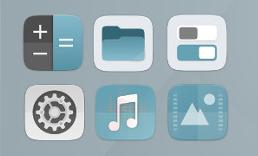

 
    

<h3 align="center">A desaturated-blue-coloured theme, designed by <a href="http://opendesktop.org/member/455718">Paul Beyens</a>, based on Andrea Bonnani's <a href="https://github.com/Magog64/SURU-PLUS">Suru++</a> and adapted to the Telinkrin GTK theme</h3>

 
    

This desaturated-blue-coloured icons theme Suru++ Telinkrin (former Telinkrin Icons Theme) was designed by <a href="http://opendesktop.org/member/455718">Paul Beyens</a> and now redesigned and powered by [Gustavo Costa](https://github.com/gusbemacbe) and [Andrea Bonnani](https://github.com/Magog64)'s Suru++. It is designed for users who use Telekrin GTK as desktop theme. 

## Installation

You can choose two option — without or with CLI. We recommend to use CLI's SVN because it is quicker like a MIllennium Falcon.  

* [Installation without CLI](instructions_without_cli.md)
* [Installation with CLI](instructions_with_cli.md)

### **AUR (Arch Linux and Arch-derived), PPA (Ubuntu and Debian-derived) and RPM**

Soon...

## Bugs and reports

### Many apps are not well displayed

It is not the pack's problem. It is the desktop files problem because:
* Snap apps are very buggy and can't be open and as Gnome-Characters, Gnome-Logs, Gravit Designer and Vectr, use the different path and use the ICO/PNG extension added instead;
* The desktop files of certain native apps as IBus and Mozc for Chinese, Japanese and Korean languages use the different relative path of an icon, use the PNG format added a SVG extension, turn the icons unrecognisable by the icons packs,

We have already reported these issues:
* CrossFTP: 
* GitHub Desktop: [view the issue](https://github.com/shiftkey/desktop/issues/42#issuecomment-387865477)
* Gravit Designer: [view the issue](https://discuss.gravit.io/t/linux-package-feature-requests/294/20)
* IBus: [view the issue](https://github.com/phuang/ibus-pinyin/issues/13)
* Mozc Setup: [view the issue](https://github.com/google/mozc/issues/440)

We provide desktop files (AppImage, native Debian packages, snap app and source codes) for you for being able of opening the apps and displaying well the icons. You can download them from  <a href="https://github.com/Magog64/SURU-PLUS/tree/master/desktop">Suru++</a>. Copy them to `your_name/local/applications/`, so they won't be affected or modified when you make next updates of Ubuntu and/or PPAs.

**Update:** GNOME developers updated the GNome version, turning Nautilus unable of opening or doubleclicking the desktop files, classifying them as untrustful. We recommend you to replace for other file manager or for graphic environment.

We recommend you to back your files up when you intend to make a clean install or reinstall your distribution.

* Do you find the missed icons?
* Do you find the misused icons?
* Did you find the errors?

Report, but please provide well-detailed informations:

* Distribution and version
* Steps to reproduce
* Expected behavior
* Actual behavior
* Description
* Missed icons
  * Apps names
  * Missed icon names from the desktop files of `/usr/share/applications` and `yourname/.local/share/applications/`):
  * Screenshots
* Additional information

## Contribution

* Would you like to improve our repository?
* Do you want to add and request the icons? Make a pull request and we will analyse and approve or not

## Contributors

The contributors is on the file AUTHORS

## Changelog

The changelog is available on the release page in theme's repository.

## License

LGPL3 © Suru++ Telinkrin by Paul Beyens, Andrea Bonnani and Gustavo Costa
